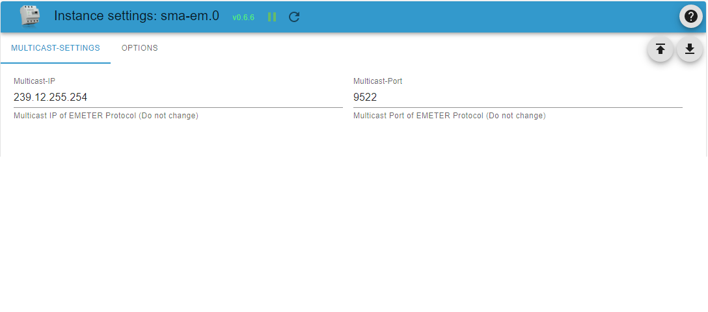

# ioBroker.sma-em

## ioBroker Adapter for SMA Energy Meter

**Tests:**   

### Info

This adapter reads information from SMA Energy Meter (EMETER-20) and Sunny Home Manager 2 (HM-20).
It supports the SMA-EMETER-protocol-2. Thus also compatible energy meters from other manufacturers will work.

SMA Energy Meter and Sunny Home Manager 2 multicast datagrams with their energy measurement data to the network once or more times per second.
The SMA Energy Meter Adapter receives these multicast messages and stores them as iobroker states.

RELEASE NOTES: Version 1.0.x includes some Breaking Changes:

- node>=16, js-contoller>=4 and admin>=6 required  
  Upgrade your ioBroker to at least this software level, if you want to use this adapter.

- Configurable Energy Meters per adapter instance  
This feature mainly has been introduced to support ioBroker auto-discovery. Normally, if you do not configure sma-em via auto-discovery you will not have to change anything in the config page because the adapter defaults to serving all reachable Energy Meters like the previous versions did.  
If you update this adapter from a previous version configured for multiple Energy Meters and decide to have only one Energy Meter in this instance from now on, just enter the IP of the desired Energy Meter. Do not forget to delete the objects in the object tree belonging to the other Energy Meters since their values will not be updated anymore. Of course you can create new instances of sma-em, one for each of these other Energy Meters.

- Selectable own network device IP to listen for multicast messages  
Previous versions of sma-em listen on all available network interfaces for Energy Meter multicasts. This results in problems when ioBroker hosts have network interfaces with multiple IP addresses or multiple interfaces in the same network. For example, a typical configuration might have eth0 and wlan0 both assigned to the same network. In this case Energy Meter multicasts arrive on both interfaces, thus effectively doubling the message rate and in some cases halve the realtime values.  
Although for compatibilty reasons the option to listen on all network interface IPs is available, one of the own network device IPs should be selected from the new config option by any means to avoid the problems mentioned above. Of course make sure to select an IP from the same network the Energy Meters are sending their multicasts. Please note that for these reasons you are prompted on the config page to explicitely enter the Own IP address even when you update the adapter from earlier versions.

- The objects "last_message" and "TimeTick" were removed  
The objects "last_message" and "TimeTick" were removed from the adapter completely since they generate an excessive load on the iobroker. If the info regarding when some objects's state value was last received and/or updated is needed, it can be read from the timestamps of the objects's state values.  
If you update this adapter from a previous version instead of a new installation, you will find that the states of the objects "last_message" and "TimeTick"  will not be updated anymore. In this case you should manually remove these objects from the object tree. The most simple solution to achieve this is to stop the adapter in the instances tab of ioBroker, completely delete the object tree in the objects tab and then restart the adapter. This of course is only neccessary once after the update and is not required if you do a clean new installation. Alternatively you can delete only the objects "last_message" and "TimeTick" from the object tree.  

### Available State Objects

### States in non-extended mode

- Instantaneous values of total active power consumption (pregard) and active power feed-in (psurplus)
- Energy meter values of total active power consumption (pregardcounter) and active power feed-in (psurpluscounter)
- Serial Number, SUSyID, Software Version of SMA Energy Meter and Sunny Home Manager
- Detailed values for each of the individual phases L1 / L2 / L3 (optional):
  - Instantaneous values of active power consumption (pregard) and active power feed-in (psurplus) per phase
  - Energy meter values of active power consumption (pregardcounter) and active power feed-in (psurpluscounter) per phase
  
### States in extended mode

In addition to the states in non-extended mode, the following values are available in extended mode

- Instantaneous values of total reactive power consumption (qregard) and reactive power feed-in (qsurplus)
- Energy meter values of total reactive power consumption (qregardcounter) and reactive power feed-in (qsurpluscounter)
- Instantaneous values of total apparent power consumption (sregard) and apparent power feed-in (ssurplus)
- Energy meter values of total apparent power consumption (sregardcounter) and apparent power feed-in (ssurpluscounter)
- cosphi (power factor)
- grid frequency (only available with Sunny Home Manager 2, SMA Energy Meter currently does not provide the grid frequency value)
- Detailed for each of the individual phases L1 / L2 / L3 (optional):
  - Instantaneous values of reactive and apparent power consumption/feed-in per phase
  - Energy meter values of reactive and apparent power consumption/feed-in per phase
  - Voltage and current per phase

### Configuration Options

- Multicast IP: The default setting is 239.12.255.254.
- Multicast Port: The default setting for the UDP port is 9522.  
  (Both should not be changed, as SMA devices always use this IP address and port)
- Own Network Interface IPs: Select box for all available Network Interface IPv4s on the ioBroker Server.
- Selected Network Interface IP: Currently selected Network Interface IP listening for Multicast messages. IP 0.0.0.0 means that the adapter listens on all available Network Interfaces (not recommended).
- Energy Meter IP: IP address of a specific Energy Meter - IP 0.0.0.0 selects all Energy Meters (default)

- Details L1 - L3: These selection options can be set to display details of each phase.
- Extended Mode: Provides more detailed information such as reactive power, apparent power, cosphi, grid frequency, voltage, current.
- Realtime Update Interval: Update Interval for realtime data like instantaneous values of power consumption (pregard) and power feed-in (psurplus). This setting throttles the update rate of the data points to any value between 1 second up to 30 seconds. The default value is 1 second.
- Non Realtime Update Interval: Update Interval for non-realtime data like instantaneous values of power consumption (pregardcounter) and power feed-in (psurpluscounter). This setting throttles the update rate of the data points to any value between 30 seconds up to 1 hour (3600 seconds). The default value is 30 seconds.

<!--
    Placeholder for the next version (at the beginning of the line):
    ### __WORK IN PROGRESS__
-->

## Changelog

### 1.0.1 (2024-01-26) - 2024 maintenance release

- (pdbjjens) Updated dependencies

### 1.0.0 (2023-08-19)

- (pdbjjens) Change: node>=16, js-contoller>=4 and admin>=6 required
- (pdbjjens) Change: Configurable Energy Meters per adapter instance
- (pdbjjens) Change: Selectable own network device IP to listen for multicast messages
- (pdbjjens) Change: Objects "last_message" and "TimeTick" were removed
- (pdbjjens) New: Support ioBroker discovery
- (pdbjjens) New: Detect SMA-EM 1.0 (SUSy 270)
- (arteck) New: Detect new SHM 2.0 with SUSy 501
- (ticaki) Fix: Catch interface errors

### 0.7.0 (2023-03-14)

- (pdbjjens) New: Configurable data point update intervals to reduce system load
- (pdbjjens) New: Use JSON config

### 0.6.6 (2023-02-28)  2023 maintenance release

- (pdbjjens) Updated dependencies
- (pdbjjens) New: Use adapter-dev instead of gulp translate

### 0.6.5 (2022-02-19)

- Updated dependencies
- Compatibility check for js-controller 4.0
- Prevent onUnload warnings

## Legal Notices

SMA and Sunny Home Manager are registered trademarks of SMA Solar Technology AG <https://www.sma.de/en.html>

All other trademarks are the property of their respective owners.

The authors are in no way endorsed by or affiliated with SMA Solar Technology AG, or any associated subsidiaries, logos or trademarks.

## License

The MIT License (MIT)

Copyright (c) 2024 IoBroker-Community

Permission is hereby granted, free of charge, to any person obtaining a copy
of this software and associated documentation files (the "Software"), to deal
in the Software without restriction, including without limitation the rights
to use, copy, modify, merge, publish, distribute, sublicense, and/or sell
copies of the Software, and to permit persons to whom the Software is
furnished to do so, subject to the following conditions:

The above copyright notice and this permission notice shall be included in
all copies or substantial portions of the Software.

THE SOFTWARE IS PROVIDED "AS IS", WITHOUT WARRANTY OF ANY KIND, EXPRESS OR
IMPLIED, INCLUDING BUT NOT LIMITED TO THE WARRANTIES OF MERCHANTABILITY,
FITNESS FOR A PARTICULAR PURPOSE AND NONINFRINGEMENT. IN NO EVENT SHALL THE
AUTHORS OR COPYRIGHT HOLDERS BE LIABLE FOR ANY CLAIM, DAMAGES OR OTHER
LIABILITY, WHETHER IN AN ACTION OF CONTRACT, TORT OR OTHERWISE, ARISING FROM,
OUT OF OR IN CONNECTION WITH THE SOFTWARE OR THE USE OR OTHER DEALINGS IN
THE SOFTWARE.
