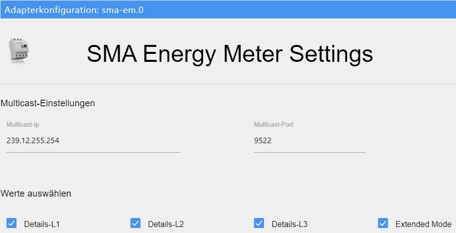
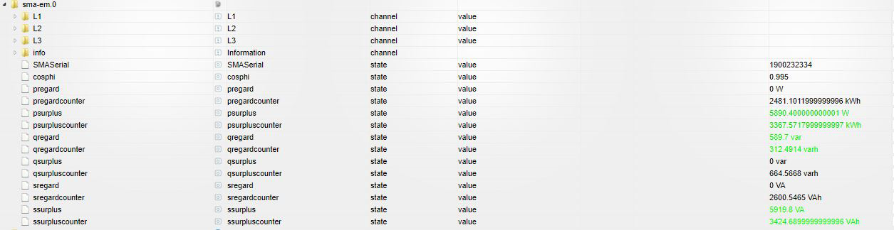

# SMA Energy Meter Adapter Dokumentation

## Allgemeine Informationen

Der SMA Energy Meter Adapter empfängt den Multicast des Energy-Meters. Dieser sendet etwa jede Sekunde ein Datenpaket ins Netzwerk.

## Administration / Admin-Seite

Multicast IP: Standardmäßig eingestellt und von SMA vorgegeben ist die IP-Adresse 239.12.255.254.
Multicast Port: Standardmäßig eingestellt und von SMA vorgegeben ist der UDP Port: 9522. 

Erweiterter Modus: Bietet detailiertere Information wie Blindleistung, Scheinleistung, cosphi, Spannungen, usw. Diese Einstellung ist standardmäßig deaktiviert. 
ACHTUNG: Der erweiterte Modus verlangt deutlich mehr Rechenleistung.

Details L1 - L3: Über diese Auswahlpunkte können Details zu jeder einzelnen Phase angezeigt werden.

## Ordnerstruktur / Objekte

Nach Installation und Start des Adapters wird wie auf dem Bild angezeigt folgende Ordnerstruktur angelegt. Im Stammverzeichnis befinden sich die Gesamtdaten des Energy Meters. In den Unterordnern L1-L3 jeweils die einzelnen Phasen.

## Erklärung der Objektnamen
Die Buchstaben P, Q und S stammen aus der Elektrotechnik und stehen für:
* P - Wirkleistung
* Q - Blindleistung
* S - Scheinleistung

- Das Wort "regard" bedeutet hier soviel wie Netzbezug. (Strom, der vom Netz bezogen wird)
- Das Wort "surplus" bedeutet Überschuss und hier soviel wie Netzeinspeisung. (Strom der ins Netz eingespeist wird)
- Das Wort "counter" bedeutet Zähler.

Daraus setzen sich die Objektnamen zusammen z.B.

- pregard - Wirkleistung Netzbezug
- psurplus - Wirkleistung Einspeisung
- pregardcounter - Zähler der Wirkleistung Netzbezug
- qregard - Blindleistung Netzbezug
- ...
