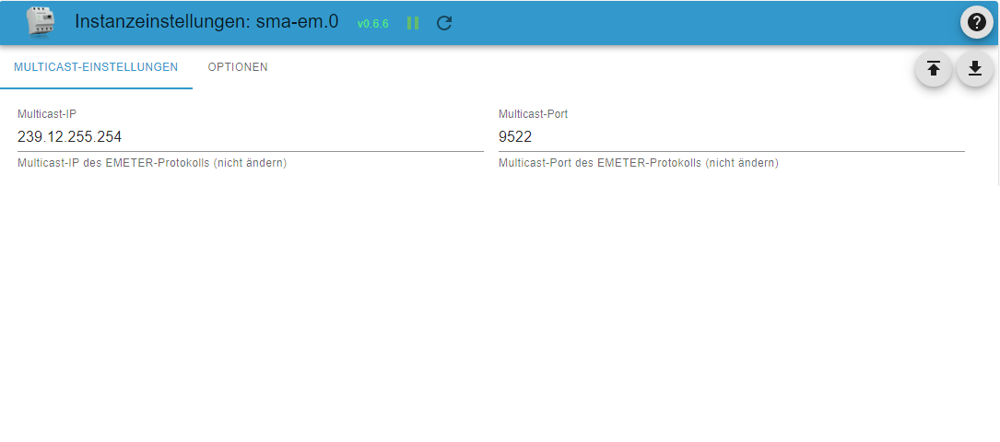
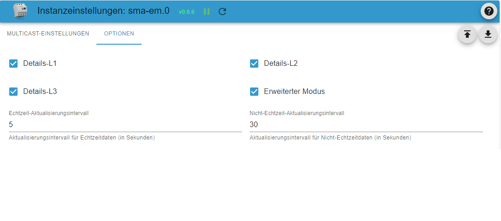

# SMA Energy Meter Adapter Dokumentation

## Allgemeine Informationen

Der SMA Energy Meter Adapter empfängt die Multicast Datagramme des Energy-Meters bzw. des Sunny Home Managers. Diese senden jede Sekunde oder öfter ein Datenpaket mit ihren Messwerten ins Netzwerk. Das Sendeintervall von 200ms, 600ms oder 1000ms ist einstellbar im Sunny Portal.

## Administration / Admin-Seite

- Reiter Multicast-Einstellungen
  - Multicast IP: Standardmäßig eingestellt und von SMA vorgegeben ist die IP-Adresse 239.12.255.254.
  - Multicast Port: Standardmäßig eingestellt und von SMA vorgegeben ist der UDP Port: 9522.

- Reiter Optionen
  - Details L1 - L3: Über diese Auswahlpunkte können Details zu jeder einzelnen Phase angezeigt werden.
  - Erweiterter Modus: Bietet detailiertere Information wie Blindleistung, Scheinleistung, cosphi, Spannungen, Stromstärke usw. Diese Einstellung ist standardmäßig deaktiviert.
  - Echtzeit-Aktualisierungsintervall: Hier wird das Update-Intervall für Echzeitdaten wie z.B Momentanleistung oder Netzfrequenz eingestellt. Dies dient der Verminderung der Systemlast. Beispiel: Bei einer Datenpaktrate von 5/s (200ms Sendeintervall) werden während eines Echtzeit-Aktualisierungsintervalls von einer Sekunde alle Werte aufsummiert und erst am Ende des Intervalls der Mittelwert bzw. bei Frequenz und Phase der Median im entsprechenden ioBroker Datenpunkt aktualisiert.
  - Nicht-Echtzeit-Aktualisierungsintervall: Hier wird das Update-Intervall für Nicht-Echzeitdaten wie z.B Zählerstände eingestellt. Hier wird erst am Ende des Intervalls der letzte empfangene Wert im entsprechenden ioBroker Datenpunkt aktualisiert.

## Ordnerstruktur / Objekte

Nach Installation und Start des Adapters wird die auf dem Bild gezeigte Ordnerstruktur angelegt. Im Stammverzeichnis befinden sich die Gesamtdaten des Energy Meters. Sofern sie konfiguriert wurden, befinden sich in den Unterordnern L1-L3 jeweils die Werte der einzelnen Phasen.
Wenn sich mehrere Energy Meter oder Sunny Home Manager im Netzwerk befinden, werden die Objektordner für jedes Gerät in derselben sma-em Instanz angelegt.

## Erklärung der Objektnamen

Die Buchstaben p, q und s und stehen für folgende Begriffe aus der Elektrotechnik:

- P - Wirkleistung
- Q - Blindleistung
- S - Scheinleistung

- Das Wort "regard" bedeutet hier soviel wie Netzbezug. (Strom, der vom Netz bezogen wird)
- Das Wort "surplus" bedeutet Überschuss und hier soviel wie Netzeinspeisung. (Strom, der ins Netz eingespeist wird)
- Das Wort "counter" bedeutet Zähler.

Daraus setzen sich die Objektnamen zusammen z.B.

- pregard - Wirkleistung Netzbezug
- psurplus - Wirkleistung Einspeisung
- pregardcounter - Zähler der Wirkleistung Netzbezug
- qregard - Blindleistung Netzbezug
- ...
